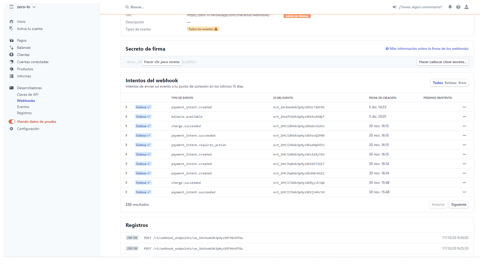

# ZeroTv Store

[Open in Heroku](https://zero-tv.herokuapp.com/catalog/)

Store online "ZeroTv" website written in Django.

we are using the API from themoviedb [themoviedb](https://api.themoviedb.org/).

## Overview

This web project is complemented by several applications that are structured as an online store;.

the main page the user will have the following characteristics without logging in:

* The user can see all movies in the stores.
* Users can select a movie and see detail, can add a movie in the cart.
* The main page has a search and filter area, the user will be able to search for the preferred movie, they will be able to search by genre, by year and by title.
* 
1. Open tab to `http://127.0.0.1:8000` to see the main site, with your new objects.

## Apps of the project
 * Catalog: this show all movies we have in database.
 * Bag: this app allows: see details of a movie and get movie for proccess payment.
 * checkout: all projecto of store need a checkout, this help proccess all payment with stripe.
 * profiles: It is the typical user application that allows you to save information about the user and related to your order.  

## Structure and Navigation

1. [Home](https://zero-tv.herokuapp.com/catalog/)
-In the home it shows us a list of movies with two columns maximum where you can navigate and see the various movies that we have in sales, you can use the side arrows to jump from one page to another, it is made up of approximately 385 pages; more than 7700 movies.

2. [Navbar](https://zero-tv.herokuapp.com/catalog/)
    - At the top right you will find the following options:
        - [Login](http://127.0.0.1:8000/accounts/login/?next=/catalog/): Clicking on this will redirect you to the login area of our application.
        - [Register](https://zero-tv.herokuapp.com/accounts/signup/?next=/catalog/): A simple area to register in our application.
        - Search: We have a local movie search engine, if you know the title of the movie, or the ID number or the date the movie was released.

    - Sub Drop Down Menu: It is composed of a series of user menu options.
        - [My_Profile](https://zero-tv.herokuapp.com/accounts/signup/?next=/catalog/): here the user can update his personal address.
        - [add_Movie](https://zero-tv.herokuapp.com/catalog/add/): The user can market his content, he can add a home movie and / or Professional, to sell it through this platform.

        - [Updata Manual ]():only used by the superuser, to update the all list of movie straight from [themoviedb](https://api.themoviedb.org).

        - [Purchase History](https://zero-tv.herokuapp.com/profiles/order_history): displays a list of the user's purchase history, with the purchase details.

        - [Logout] (https://zero-tv.herokuapp.com/accounts/logout/?next=/catalog/): It is the typical link that helps us to leave the platform.

3. [Menu Veltical o Setting Menu ](https://zero-tv.herokuapp.com/accounts/logout/?next=/catalog/):In this menu, display a series of options concerning the user.

    - [Set Password](https://zero-tv.herokuapp.com/accounts/password/change/): We offer you this very common option on all platforms, so that you can have total control of the security of your account, you can change periodically at your pleasure; the password of your account on our platform.

4. Frameworks, Libraries & Programs Used
    - Django 3.0.7 : We use Django to manage and create the content according to the application we want.

    - Bootstrap 4.5.0: was used to assist with the responsiveness and styling of the website.
    - asgiref 3.2.10: We use this standard measure for Python web applications and asynchronous servers to communicate with each other.
    - certifi 2020.6.20 : Certifi This helps us validate the trustworthiness of SSL certificates while verifying the identity of TLS hosts.
    - django-allauth 0.42.0: Integrated set of Django applications addressing authentication, registration, account management as well as 3rd party (social) account authentication.
    - django-countries 6.1.3:  it is a list of countries in United State.
    - django-crispy-forms 1.9.2: we use crispy to render the forms in a clean way.
    - django-heroku 0.3.1 : This is a Django library for Heroku applications that ensures a seamless deployment and development experience.
    - gunicorn 20.0.4: Server is widely compatible with various web frameworks, implemented simply, light on server resource usage, and quite fast.
    - stripe 2.51.0: we use stripe to make the payment process possible.
    - jQuery: came with Bootstrap to make the navbar responsive but was also used for the smooth scroll function in JavaScript.
    - Git: was used for version control by utilizing the Gitpod terminal to commit to Git and Push to GitHub.
    - GitHub: is used to store the projects code after being pushed from Git.
    - Stripe: used with javascripts language, to proccess all payment of the zero-tv.

5. Languages Used
    - HTML5
    - CSS3
    - Python
    - Javascripts

## Unit Test

**Django**

    I did apply a test to each of the applications in this project, from django.test import TestCase, from django.test import TestCase, Client 
from django.urls import reverse and from .models import UserProfile in the file.py I readed the test, running python manage.py test; each of these tests corresponds to each application of this project.

    Also I did copy and paste all file view.py for each app of the project in http://pep8online.com/ to check the code.

**styles.css**
- The file styles.css located in staticfiles/css I loaded in http://jigsaw.w3.org in the option css-validator and clicked in check.
    

    
    

**data.js**
- In https://jshint.com/ I copy my javascripts code and tested all code in the file located staticfiles/js/data.js; my code is jqury code.

## git and github

**Github**
I created a github repository in github
I get a name "zero-tv"
I keep public repository

**Git**
Before start the app, I created the directory zero-tv, in the directory I did my virtual enviroment django-venv and activate (source django-venv/Scripts/activate), and I did admin-start zerotv to create my project in Django; after configure all password and sensitive data, I did a admin-start catalog.
I did git init.
I created my file readme.md
I did git remote add origin https://github.com/jansgreen/zero-tv.git to add the repository remote.
Afther my app is ready I make a git push origin master. to save in github repository.

## Heroku Deployment implementation
I created a user on heroku at https://www.heroku.com/, create the application and assign it a name "zero-tv"; Once my application is ready, create the variables
These are the variables in the heroku settings:
Access_key: This is the variable that stores the access key that we use for mongodb connection.

- API_KEY: This variable has the API key of the website that extracts the data from the movies.

- DATABASE_URL:This variable has the link that connects to the postgress database that we use to save the movies

- DEFAULT_FROM_EMAIL:This variable saves the email that is set as the default for the django project.

- DEVELOPMENT: This is a boolean that returns false so django knows how to handle the data when in heroku.

- DJANGO_SECRET_KEY: This variable stores the secret key that django offers us to work with said framenetwork

- EMAIL_HOST_PASS: This variable saves the password of applications that gmail offers us, in gmail configuration, security, two-step verification, register the application that will access the mail, in my case I put django as the tutorial.

- EMAIL_HOST_USER: This variable saves the sender's gmail email in order to validate their account at the time of registration.

- STRIPE_PUBLIC_KEY: This variable saves the public key that the stripe API offers us to access the stripe platform.

- STRIPE_SECRET_KEY: These variables have the secret key that stripe offers us, without this each process will return a 503 that is access denied.

- STRIPE_WEBHOOK_KEY:This variable has the WEBHOOK key, this allows us to access to see all the events that the user made in our application at stripe.com

# Buildpacks heroku / python (with this I specify to heroku that the programming language I will use is python)
After having configured the variables, I created my procfile (Procfile) file in my local application with the following web configuration: gunicorn run: app, thus telling heroku to run the gunicorn server for this application. and then download Heroku CLI. as I had already done git init in the folder of my application and within it I did the following steps to deploy in Heroku: $ heroku login $ heroku git: remote -an emergency level git add. git commit -m "implement in heroku" git push heroku master.

## Django apps

* This project has 4 applications that make this project possible in django.

**Data store integration**
This project saves is designed to use and save data in different ways, when it is in production it saves the data in the db.sqlit3 database in the local repository, but when it is in heroku it gets access to the postgress database DATABASE_URL. the changes saved in production we apply the makemigrations end migrates commands to send that data to the corresponding columns; in heroku with the Heroku CLI, we use those same commands by doing Heroku run python manage.py makemigrations and Heroku run python manage.py migrate.

**catalog**
* This application displays a list of 9354 movies that you can taste by clicking on the side arrows; It also allows us to add the movies that the user wants to our database; In the same way, this application allows the user to edit and / or delete the movie that he has created in the application.

### fixtures
- The fixtures directory has three files.json, Classification.json, genres.json and movie.json, those files are structured as required by the django documentation. it has a model with the name of the database followed by the period and the name of the same json file; A pk this has the order number of each object that this json file has and finally the fields, which has all the information of the fields that the items store.

### admin.py 
- The django administrator file, in this file with the help of the classes it has, helps me to display the fields that it will show in the django admin part.

### API.py
- This application helped me extract the information from another application to convert it into a json file, in the case of the movies, I integrated it directly, due to the id of the related databases. with the classifications and the genres of movies.

### Models.py
- In this models file we have three important classes that define our project, the main class is Movies, this has two fields related to the classification and genres of movies.

### Forms.py
- This form has the ProductForm class, it saves the movie genre form and the movie classifications, to be displayed in the django manager part and in the add movie HTML file.

### Static
- This directory stores the directives that have the css, javascript files and the images that are displayed in this project.

### templates
- This directory is searched by default by django's framenetwork to run the HTML files in each application.

### URL
**path('', views.index, name='index')**
- This url takes us to the main page of the project, I will refer to the project index and we have nicknamed it index.

**path('gendres', views.Upload_gendres, name='Upload_gendres')**
- This url gives superuser access to update the movie genres in the json file; create an updated json file of the external api.

**path('movies', views.Upload_Movies, name='Upload_Movies')**
- this path is only accessible to the super user; this allows to update the json file of the movies.

**path('account', include('allauth.urls'))**
- this path gives us access to the allauth functions that django offers us by default.

**path('add/', views.add_Movies, name='add_Movies')**
- This path is designed to add new movies to our movie list, it is nicknamed add_movies.

**path('edit/<int:Movies_id>/', views.edit_Movie, name='edit_Movie')**
- This path to edit loads a whole number with it, from the edit movie function nicknamed as edit name, it helps us to edit the movies already saved in our database.

**path('delete/<int:Movies_id>/', views.delete_Movie, name='delete_Movie')**
- This path loads an integer ID number to specify the movie to be deleted, only super user can delete movie

**path('Manual', views.Manual, name='Manual')**
- This manual path loads the manual function of the view file and nicknamed with the same name, it directly updates the movie database without having to go through the json file, this was strictly necessary since the data from the json file comes with the related fields and the database did not assimilate it.

**bag**
* After having selected the movie of your interest, and having registered correctly, the user can see the details of the selected movie, Delete or Edit the movie, also the user can select the amount of movie that can be saved in his bag; thanks to this bag application, which also shows us a list of all the movies that you have saved in your bag.

- mymovies.py, Following the instructions of the Boutique Ado tutorial, we create this file which helps us to save in the section and process the prices and quantity of the items.

### urls: 
- I have included from the views file, all the functions that the url needs to make the navigations adequate. in the bag application are the following:

**path('', index, name='bag'),**
* This path with the function called index nicknamed by the url bag.

**path('<int:id_movie>', views.id_movie, name='id_movie')**
* This path makes a call to the view function called id_movie and nicknamed with the same name, it passes an integer that has the id of the movie.

**path('<movie_title>', views.a_movie, name='a_movie')**
* This path calls the a_movie function that takes us to the HTML file Amovie, it has the title of the movie, to show all the details of the movie selected by the user.

**path('add/<int:id_movie>', views.push_bag, name='push_bag')**
* This path called add loads an integer from the push_bag function nicknamed with the same name, this makes it possible to redirect to the html file save_movies, so that the user can save the movie that he will soon process to buy.

**path('updata/<int:Movies_id>', views.updata, name='updata')**
* This path goes together with the previous one, it calls the updata function nicknamed with the same name; and load an integer number, which indicates the amount of film that will load in your volsa, to be updated and if in case the number is zero it will be eliminated from the bag list.

**path('bag/save_movies', views.save_movies, name='save_movies')**
* This path called bag / save_movies loads a list that displays one or all the movies selected by the user.

**checkout**
* As its name says, this application helps us to process the items that we have stored in our bag, this is possible to the stripe API, when processing the payment it displays a floating window of stripe, to confirm the payment that the user plows to the time to pay for the items.

**admin.py**
- This file shows us the fields of each purchase process on the django admin side, this is composed of two classes OrderLineItemAdminInline, OrderLineItem.

**Forms.py**
- This file stores the essential fields of the purchase process form, such as the main information of the user where the product will be sent, among other information.

**models.py**
- This model file is made up of two classes; the order class that is the one that contains the fields that will be defined as columns in the table of the user's purchase information database and the OrderLineItem class that is the one that contains the order line that stores the quantity and total of the order.

**signal.py**
- This file contains a token that helps allow undocked applications to be notified when actions occur elsewhere in the framework. Simply put, signals allow certain senders to notify a set of receivers that some action has been taken.

### URL

**path('', views.checkout, name='checkout')**
- like all applications, they have a path that tells django where to look for the application's index.

**path('checkout_success/<str:order_number>', views.checkout_success, name='checkout_success')**
- The checkout_success this path calls the function in the view of the same name that indicates that the user has made a purchase process, this path loads a variable that carries the information of said process.

**path('cache_checkout/', views.cache_checkout, name='cache_checkout')**

**profiles**
* This application will help us to save the important information of the user such as the address among other data, this application is associated with the user library that django brings, we link it with a related field in the models file of the same application.

## Authentication and Security
*When the user visits our project, he can see the list of all our films and can even see the details of each one of them, but in order to make a purchase; the user has to register.

## Layout and Visual Impact
* Responsive Design: Our responsible design covers the different diameters of the devices that will access our projects. from 2560px x 1020px to 320px x 1020px.

* Image Presentation: Our project has a background image that is designed to give our project a science fiction environment. When the user logs in, it will change to a black background, this is so that the user does not get tired.

* Colour scheme and typography:the predominant color of this project is blue, with white letters and if the user is logged in, the background is black.

## Defensive Design
We have used the category that django offers us to show the correct message to the user, at the time of making a purchase, which will indicate an error message if an error has occurred etc ...

## stripe.com

I create an account in stripe, and copy the public key of my stripe account that is located in the control panel, standard keys, then reveal the secret key to be copied too; Here, with the help of Stripe's documentation, I went to checkout, select the option to accept a payment.

integrate stripe into my project using pip install --upgrade stripe and then pip freeze> requirement.txt to update my requirement.txt library.

create the html file corresponding to checkout and embed the stripe script . then copy and paste the codes from the stripe documentation and condition it to this project.

In the checkout application in static \ checkout \ javascripts \ stripe.js, you can find the javascript file of the stripe code, this code was copied from the stripe documentation and conditioning to this project.

We use stripe's webhooks to notify the checkout application when an event occurs. Webhooks are particularly useful for asynchronous events such as when a customer's bank confirms a payment, a customer disputes a charge, or a recurring payment succeeds.

So do the steps to create webhook:

Create a webhook endpoint in my application and with the secret key create a file called webhook_handler.py.
Use the Stripe CLI to test that your endpoint works.

### Testing
After you have configured the working payment button that redirects your customer to Stripe Checkout.

enter the test card number 4000 0025 0000 3155 05 55 55 5555.
I clicked the payment button.
and I was redirected to a Stripe Checkout payment form.

**webhook**
In the developers option called webhook, and the test data option turned on, I could see the results of each test performed.

## Procfile
web: gunicorn locallibrary.wsgi:application : use this procfile to tell heroku to run this application with gunicorn; and that the server of this application is located in locallibrary.

    

